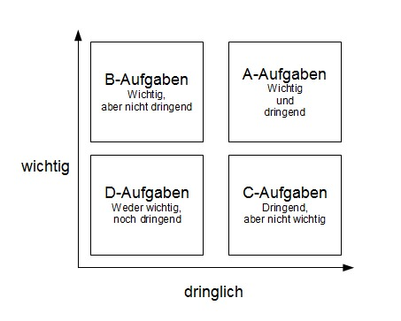

# Dokumentation Projektarbeit M226B & M120

> Lian Studer & Kris Huber, 13.05.2022

## Inhaltsverzeichnis

- [Dokumentation Projektarbeit M226B \& M120](#dokumentation-projektarbeit-m226b--m120)
  - [Inhaltsverzeichnis](#inhaltsverzeichnis)
  - [Einleitung (Management Summary)](#einleitung-management-summary)
  - [Planung](#planung)
    - [User Stories \[Grobkonzept II\]](#user-stories-grobkonzept-ii)
    - [Scribbles \[Grobkonzept II\]](#scribbles-grobkonzept-ii)
    - [Prototyp \[Detailkonzept II\]](#prototyp-detailkonzept-ii)
    - [Usability Tests \[Detailkonzept III\]](#usability-tests-detailkonzept-iii)
  - [Umsetzung](#umsetzung)
    - [Views \[Umsetzung I\]](#views-umsetzung-i)
    - [MVC Pattern \[Umsetzung II\]](#mvc-pattern-umsetzung-ii)
    - [Implementation des MVC Pattern \[Umsetzung III\]](#implementation-des-mvc-pattern-umsetzung-iii)

## Einleitung (Management Summary)

**Autoren**: Lian Studer, Kris Huber

**Erstelldatum**: 13.05.2022

## Planung

In diesem Abschnitt ist der Planungsprozess dokumentiert.

### User Stories [Grobkonzept II]

In der folgenden Tabelle sind sämtliche User Stories aufgelistet, welche in diesem Projekt umgesetzt werden sollen. Die Tabelle ist nach Priorität der User Story sortiert. Jede User Story hat zusätzlich eine Liste von Abnahmekriterien, welche festlegen, wann eine User Story als implementiert und abgeschlossen gilt. Die letzte Spalte der Tabelle signalisiert, ob eine User Story abgeschlossen wurde, oder nicht.

**Bedeutungen der Emojis:**

- Abgeschlossen: ✔️
- Nicht abgeschlossen: ❌

| ID    | User Story                                                   | Abnahmekriterien                                             | Priorität*¹ | Status |
| ----- | ------------------------------------------------------------ | ------------------------------------------------------------ | ----------- | ------ |
| **1** | Als Benutzer möchte ich die neusten Blogposts nach Kategorie sortiert sehen. | - Ein Blogpost wird in der richtigen Kategorie angezeigt. - Blogposts sind nach Kategorien gruppiert/sortiert. - Alle Kategorien werden angezeigt. - Es werden nur die fünf neusten Blogposts pro Kategorie angezeigt. | D           | ❌      |
| **2** | Als Benutzer möchte ich weitere Blogposts einer Kategorie sehen, wenn ich auf die Kategorie klicke. | - Ein Blogpost wird in der richtigen Kategorie angezeigt. - Alle Blogposts der Kategorie werden angezeigt. - Die Blogposts sind nach Erstelldatum sortiert. | D           | ❌      |
| **3** | Als Benutzer möchte ich einen neuen Blogpost erstellen können. | - Feld für Titel - Feld für Inhalt - Veröffentlichungsstatus kann festgelegt werden (Entwurf, Veröffentlicht) - Kategorie kann ausgewählt werden | A           | ❌      |
| **4** | Als Benutzer möchte ich mich Anmelden können.                | - Feld für Benutzername - Feld für Password              | A           | ❌      |
| **5** | Als Benutzer möchte ich meine Blogposts bearbeiten können.   | - Titel, Inhalt, Veröffentlichungsstatus und Kategorie können verändert werden. | C           | ❌      |
| **6** | Als Benutzer möchte ich mein Profil bearbeiten können.       | - Benutzername, Passwort, Biografie und Profilbild können bearbeitet werden. | B           | ❌      |

*¹ **Prioritäten**

Die Priorisierung erfolgt nach der Eisenhower Matrix. Sie ist in der folgenden Graphik abgebildet. Mehr Information finden Sie [hier](https://de.wikipedia.org/wiki/Eisenhower-Prinzip). 

### Scribbles [Grobkonzept II]

> Die Scribbles für die Abgabe "Grobkonzept II" wurden separat abgegeben. Sie werden zu einem späteren Zeitpunkt noch zu diesem Dokument hinzugefügt.

### Prototyp [Detailkonzept II]

> Inhalte folgen

### Usability Tests [Detailkonzept III]

> Inhalte folgen

## Umsetzung

> Inhalte folgen

### Views [Umsetzung I]

> Inhalte folgen

### MVC Pattern [Umsetzung II]

> Inhalte folgen

### Implementation des MVC Pattern [Umsetzung III]

> Inhalte folgen
